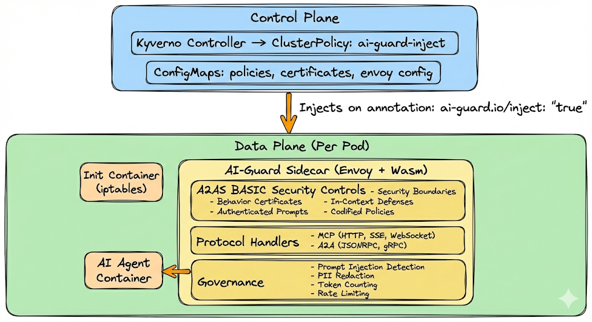

# AI-Guard: Headless AI Governance

[](LICENSE)
[](https://modelcontextprotocol.io/specification/2025-11-25)
[](https://a2a-protocol.org/)
[](https://a2as.org/)

**Production-grade AI governance using the Distributed Interceptor Pattern.**

AI-Guard moves governance from centralized gateways directly to workloads using Envoy sidecars and WebAssembly, eliminating hairpinning and providing sub-millisecond overhead.

## Key Features

- **Zero-Hop Governance** - Security controls at the sidecar, no central gateway bottleneck
- **Full Protocol Support** - MCP (HTTP, SSE, WebSocket) and A2A (JSONRPC, gRPC, HTTP+JSON)
- **STDIO Blocking** - Enforce network-only communication for mesh visibility
- **A2AS BASIC Security** - Complete implementation of Agentic AI Runtime Security
- **Memory Efficient** - Streaming body inspection with constant memory (ring buffer)
- **Automatic Injection** - Kyverno-based sidecar injection via annotations

## Quick Start

```bash
# One-command setup (KIND + Kyverno + AI-Guard)
make quick-start

# Run demo scenarios
make demo

# View logs
make logs
```

### Windows (PowerShell) Quick Start

If you’re on Windows and `make`/shell compatibility is an issue, use the PowerShell runner:

```powershell
.\scripts\ai-guard.ps1 quick-start
```

### Docker Desktop Kubernetes (force docker-desktop context)

To deploy **only** to Docker Desktop Kubernetes (never your current kube context):

```powershell
.\scripts\ai-guard.ps1 setup-docker-desktop
.\scripts\ai-guard.ps1 deploy-kind   # deploys to the active target context (docker-desktop here)
.\scripts\ai-guard.ps1 test
```

## Architecture


## Protocol Support

| Protocol | Transport | Support | Notes |
|----------|-----------|---------|-------|
| MCP | HTTP | ✅ Full | JSON-RPC 2.0 validation |
| MCP | SSE | ✅ Full | Ring buffer streaming |
| MCP | WebSocket | ✅ Full | Frame inspection |
| MCP | Streamable HTTP | ✅ Full | Chunked encoding |
| MCP | **STDIO** | ❌ **BLOCKED** | NetworkPolicy + Kyverno |
| A2A | JSONRPC | ✅ Full | Message validation |
| A2A | gRPC | ✅ Full | Protobuf inspection |
| A2A | HTTP+JSON | ✅ Full | REST schema validation |

## Usage

### Enable AI-Guard for a Pod

Add the annotation to automatically inject the AI-Guard sidecar:

```yaml
apiVersion: v1
kind: Pod
metadata:
  name: my-ai-agent
  annotations:
    ai-guard.io/inject: "true"
    ai-guard.io/policy: "default"        # Optional
    ai-guard.io/certificate: "agent-v1"  # Optional
spec:
  containers:
    - name: agent
      image: my-ai-agent:latest
```

### Deployment-Level Injection

```yaml
apiVersion: apps/v1
kind: Deployment
metadata:
  name: ai-agent-fleet
spec:
  template:
    metadata:
      annotations:
        ai-guard.io/inject: "true"
```

## A2AS BASIC Security Model

AI-Guard implements the complete A2AS (Agentic AI Runtime Security) BASIC model:

| Control | Purpose | Implementation |
|---------|---------|----------------|
| **(B)** Behavior Certificates | Agent capability declaration | JSON manifests with permissions |
| **(A)** Authenticated Prompts | Context integrity verification | SHA-256 hashes per request |
| **(S)** Security Boundaries | Untrusted input isolation | XML-style boundary tags |
| **(I)** In-Context Defenses | Secure model reasoning | Meta-instructions in context |
| **(C)** Codified Policies | Domain-specific rules | Policy-as-code ConfigMaps |

## Make Targets

```bash
# Quick Start
make quick-start    # One-command full setup
make demo           # Run all demo scenarios

# Build
make build-wasm     # Build Wasm filter
make build-images   # Build Docker images

# Deploy
make setup-kind     # Create KIND cluster with Kyverno
make deploy-kind    # Deploy to KIND
make deploy-compose # Deploy via Docker Compose

# Test
make test           # Run all tests
make test-mcp       # Test MCP protocol
make test-a2a       # Test A2A protocol
make test-a2as      # Test A2AS controls

# Demo
make demo-user-to-agent   # User attack demo
make demo-agent-to-tool   # Tool poisoning demo
make demo-agent-to-agent  # Agent infection demo
make demo-pii             # PII detection demo

# Observability
make logs           # View Envoy logs
make logs-wasm      # View Wasm filter logs
make metrics        # Show Prometheus metrics
make status         # Component status

# Clean
make clean          # Remove build artifacts
make clean-kind     # Delete KIND cluster
make clean-all      # Full cleanup
```

## Project Structure

```
ai-guard/
├── AGENTS.md                    # Development guidelines
├── Makefile                     # Build automation
├── wasm-filter/                 # Rust Wasm filter
│   └── src/
│       ├── config.rs           # Configuration (from Envoy)
│       ├── streaming/          # Ring buffer, UTF-8 handling
│       ├── governance/         # PII, rate limiting, etc.
│       └── protocols/          # MCP & A2A handlers
├── envoy/                       # Envoy configurations
├── kubernetes/                  # K8s manifests
│   ├── kyverno/                # Injection & network policies
│   └── configmaps/             # Policy & certificate ConfigMaps
├── docker/                      # Docker Compose setup
├── policies/                    # Policy examples
├── certificates/                # Behavior certificate examples
└── demo/                        # Attack vector demos
```

## Standards Compliance

- **MCP**: [Model Context Protocol 2025-11-25](https://modelcontextprotocol.io/specification/2025-11-25)
- **A2A**: [Agent-to-Agent Protocol](https://a2a-protocol.org/latest/definitions/)
- **A2AS**: [Agentic AI Runtime Security](https://a2as.org/)

## References

- [Envoy Proxy](https://www.envoyproxy.io/)
- [proxy-wasm Rust SDK](https://github.com/proxy-wasm/proxy-wasm-rust-sdk)
- [Kyverno](https://kyverno.io/)
- [KubeCon Talk: Kyverno Envoy Plugin](https://www.youtube.com/watch?v=XMtVHDTXD6c)

## Contributing

See [AGENTS.md](AGENTS.md) for development guidelines, especially:

- **Memory Management**: Use streaming, not accumulation
- **Pattern Matching**: FSM, not regex
- **Configuration**: From Envoy plugin config, not files
- **UTF-8**: Handle chunk boundaries with `Utf8Buffer`

## License

Apache 2.0 - See [LICENSE](LICENSE) for details.
